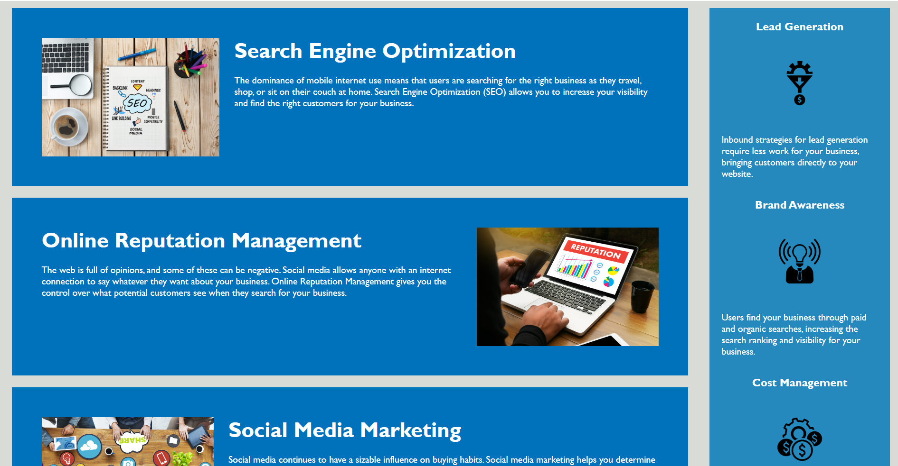

# code-refactor-challenge
First Challenge for the University of Birmingham bootcamp in web-developing and UX

## Description

This was the first challenge for the University of Birmingham bootcamp in front-end web-developing and UX. In this challenge, we had to refactor code. Our client was a marketing agency and they wanted to optimise their exisisting website for with accessibility in mind. 

Guidelines for successful completition of this challenge included making sure that semantic html was used throughout and that it followed a logical structure; images and icons contained alt attributes; heading followed a sequential order;CSS selectors and properties had to be organised, consolidated and comments added for each section; titles needed to be concise and descriptive.

This challenge really helped me understand the structure of both HTML and CSS and how a site should be designed with accessibility in mind. It helped me develop my 'proofreading' and 'editing' skills when it comes to looking at previously written code. 

## Installation

N/A

## Usage

This is a simple homepage. All you need to do is open the webpage with your browser. The navigation bar has clickable links that take you to each of the main sections of the page. There is an aside on the right of the page, which highlights all the advantages of using this marketing company. 

md
    

 md   
    
    
md
    

    
## Credits

I read the following articles to help me complete this challenge: 

[Read Me Guide](https://coding-boot-camp.github.io/full-stack/github/professional-readme-guide)
[Getting started With Github](https://docs.github.com/en/get-started/writing-on-github/getting-started-with-writing-and-formatting-on-github/basic-writing-and-formatting-syntax)
[HTML tags](https://allthetags.com/)
[Commit Message Guidelines](https://www.freecodecamp.org/news/writing-good-commit-messages-a-practical-guide/)
[CSS Organisation](https://developer.mozilla.org/en-US/docs/Learn/CSS/Building_blocks/Organizing)
[Semantic Html](https://gist.github.com/kingluddite/e4a9018c5b793b162f6dd95c84c4acab)

## License
Please refer to the license in the repo. 

